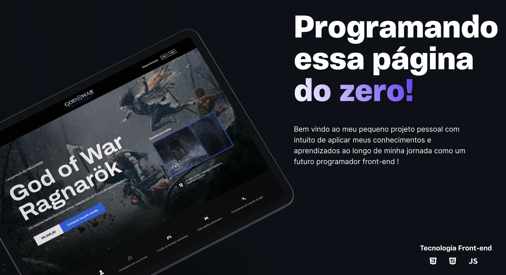

<h1 align="center"> Layout God of War Ragnarök </h1>

Evento gratuito, promovido pela Coodebost para ensino de tecnologias WEB.

  <a href="#-tecnologias">Tecnologias</a>&nbsp;&nbsp;&nbsp;|&nbsp;&nbsp;&nbsp;
  <a href="#-projeto">Projeto</a>

 

  

## 🚀 Tecnologias

Esse projeto foi desenvolvido com as seguintes tecnologias:

- HTML e CSS
- JavaScript 
- Scss
- Git e Github
- Biblioteca Swiperjs

## 💻 Projeto
  Simulando uma pagina de pré-venda de um jogo. 
  Layout responsivo, se adptando há variados tamanhos de tela, animações de entrada, pequeno slide com scroll na horizontal.
